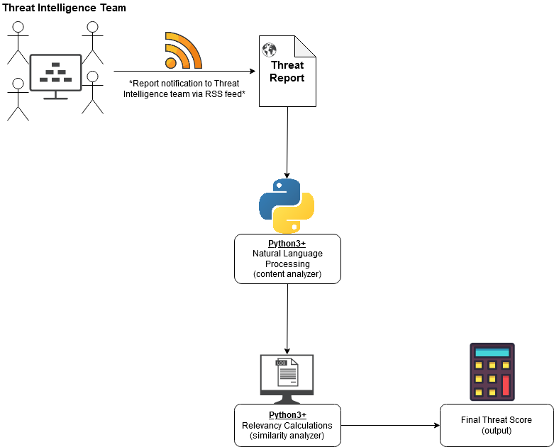
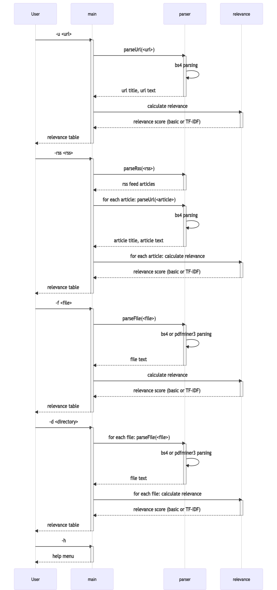
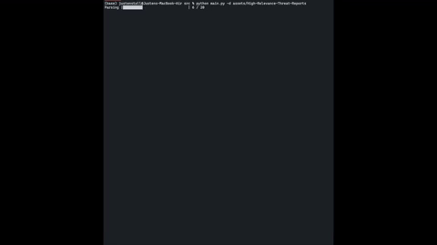
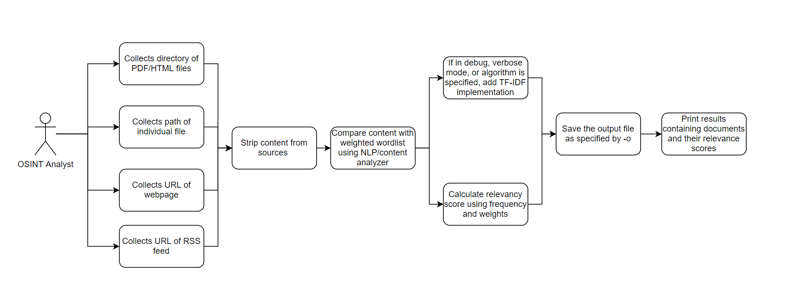
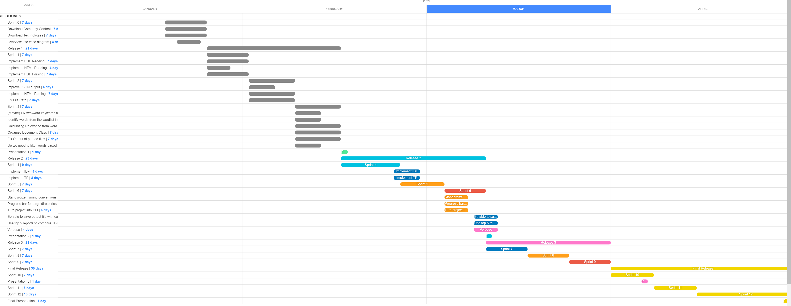
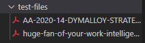
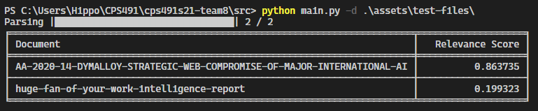
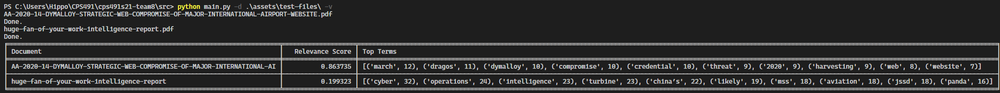
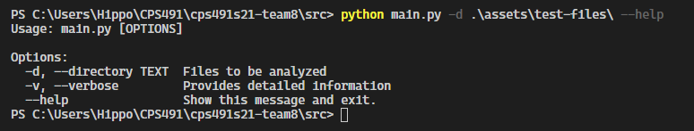

University of Dayton

Department of Computer Science

CPS 491 - Spring 2021

Dr. Phu Phung

## Capstone II - Team 8

# Cyber Threat Reports

# Team members

1. Beth Hosek, <hoseke1@udayton.edu>
2. Dena Schaeffer, <backd1@udayton.edu>
3. Jacob Scheetz, <scheetzj2@udayton.edu>
4. Justen Stall, <stallj2@udayton.edu>

# Company Mentors

Jeffrey Archer, Senior Staff Cybersecurity Researcher

GE Aviation

Cincinnati, OH

## Project Management Information

Link to public repository: <https://bitbucket.org/cps491s21-team8/cps491s21-team8.bitbucket.io/src/master/>

Link to private repository: <https://bitbucket.org/cps491s21-team8/cps491s21-team8/src/master/>

Link to Trello: <https://trello.com/b/LNj1LyZ5/ge-project>

Project Homepage (Public):<https://cps491s21-team8.bitbucket.io/>

## Overview

The goal is to develop a classification system that can analyze the text of a threat intelligence report and produce a score which quantifies the relevancy of that report to the receiving organization based on a list of user-defined relevant topics.



Figure 1. - A Sample of Overview Architecture of the project.



Figure 2. - A full system diagram of the project.

# Project Context and Scope

This project will be used by GE Aviation's Cyber Intelligence team to provide a priority to their research of open-source intelligence(OSINT) reports. As a global company doing high-value work, the volume of relevant reports published daily is too much for even a large team of analysts to read and understand quickly. Our tool would help give priority to what reports need to be read first and what can be overlooked, making sure each piece of vital information gets the attention it needs.

# High-level Requirements

- A natural language processor/content analyser to analyze the contents of threat reports and pick out key terms and themes
- Similarity analyzer to compare the output of the content to a user
- Significance/relevance score calculator that generates a numerical representation of the output of the similarity analyzer to indicate how relevant a report is to the user-defined list of topics.

# Program Example


# Use Cases and Functional Requirements



Figure 3. - Overview Use Case Diagram


- Functional Requirement: Download necessary technologies such as VS Code, Python 3.8+, etc. so we can begin working on user stories for Sprint 1
- Functional Requirement: Download company project specific content so we can begin working on user stories for Sprint 1

- User Story: User should be able to input a PDF file and the script should return a JSON file containing a Document object. The Document object should have the name of the pdf parsed, the path, the words in the file and a count of the most common words. 
  - Actor: User from OSINT Team 
  - Use Case: supply the script with a directory and the feed returns a list of the most common words in each file 

- Functional Requirement: Understand the pdfminer library so that efficient document parsing and word splitting can be implemented
- Functional Requirement: Split words in a consistent manner to minimize the number of errors that result in the output

- User Story: User should be able to input a directory containing both HTML and PDF files and the script should return a JSON file containing a Document object. The Document object should have the name of the pdf parsed, the path, the words in the file and a count of the most common words. 
  - Actor: User from OSINT Team 
  - Use Case: supply the script with a directory containing either just HTML files, just PDF files or a combination of the two and the script will be able to distinguish whether to parse the files as PDF or HTML

- User Story: User is able to get meaningful feedback (output) from the program since the 300 most common english words + others are now being filtered from the output
   - Actor: User from OSINT Team
   - Use Case: When team member reads the output they are able to easily identify words that would raise cause for alarm as the 300 most common english words no longer flood the output files

- User Story: User is able to see meaningful relevance scores genereated by the tf-idf model algorithm
    - Actor: User of the program
    - Use Case: When a team member runs the program on a directory of pdf or html files, they are returned meaninful relevance scores from the program to rank the files in a directory based on the tf-idf model

- User Story: When a user runs the program they are able to actively track the progress of the file parsing via a progress bar and they are also presented with formatted output in a table-style layout
    - Actor: User of program
    - Use Case: When a team member runs the program they are presented with a sorted, orderly output and are also able to see the progress of the program as it runs

- User Story: User is able to use different options on the command line interface via switches, so that different functionality of the program is controllable from the user
    - Actor: user of program 
    - Use Case: the user can use differing switches on the program from the command line, like -v for verbose output, to achieve different features and functionalities from the program


# Technology

- Python3.8 (relevancy calculator, natural language processing)
    - Libraries used:
        - json: to support reading and writing json files
        - sys, os: to support opening directories
        - pdfminer3: to support parsing pdf files for words
        - BeautifulSoup4: to support parsing html files for words
        - click: to support a customizable Command Line interface (CLI) for the program
        - tabulate: to support an easily digestable output from the program
        - progress: used to create a progress bar so the user is able to see the progress of the execution of the program  
- RSS feeds (data collected via RSS feeds)
- TF-IDF modeling

# Implementation
- The results rely on three primary equations using TF-IDF. Implementation of these is shown below.

## TF: Term Frequency

This method essentially calculates how frequent a term appears in a document by looping through the words from the document. This is a subequation of the entire TF-IDF fucntion, where the results of this method act as arguments for the TF-IDF method. 

```python
def computeTF(wordDict, bagOfWords):
    """
    Caluclates Term-Frequency: measures how frequent a term appears in a document. 
    TF(t)= (Number of times term t appears in a document) / (Total number of terms in the document)

    Parameters
    ----------
    wordDict : dict
        The custom wordlist
    bagOfWords : dict
        All words in the document with their frequency - negates common words
    """

    tfDict = {}
    bagOfWordsCount = len(bagOfWords)
    for word, count in wordDict.items():
        tfDict[word] = count / float(bagOfWordsCount)
    return tfDict
```

## IDF: Inverse Document Frequency

In this, it calculates how important a term is to the document by using its weights. This is a logarithmic function, so it adjusts the weights for terms listed many times to allow scaling. This is another subequation of the entire TF-IDF fucntion, where the results of this method act as arguments for the TF-IDF method. 

```python
def computeIDF(documents, allWordCount):
    """
    Calculates Inverse Document Frequency: measures the importance of the term using weights 
    IDF(t) = log_e(Total number of documents / Number of documents with term t in it).


    Parameters
    ----------
    documents : list
        All documents in the folder
    allWordCount : dict
        All words with their wordcounts - negates common words
    """

    N = len(documents)
    #print(documents)

    idfDict = dict.fromkeys(allWordCount.keys(), 0)
    for document in documents:
        for word, val in document.items():
            if val > 0:
                idfDict[word] += 1
                
    for word, val in idfDict.items():
        idfDict[word] = math.log(N / float(val))
    return idfDict
```

## TF-IDF: Combines results from TF and IDF

This uses the results from TF and IDF as its arguments to calculate how important a word is to a document by comparing it to other documents in the corpus, resulting in a relevance score. 

```python
def computeTFIDF(tfBagOfWords, idfs):
    """
    Calculates TF-IDF: Statistical measure used to evaluate how important a word is to a document. 

    Parameters
    ----------
    tfBagOfWords : dict
        Result from computeTF()
    idfs : dict
        Result from computeIDF()
    """
    tfidf = {}
    for word, val in tfBagOfWords.items():
        idfValue = idfs.get(word, 0)
        tfidf[word] = val * idfValue
    return tfidf
```


# Company Support

Our company mentor, Jeffrey Archer, has already provided us with the files and technology requirements we need for this project. He also has provided us with an open source for communication whenever necessary, and a plan to meet at least once per release cycle.

# Software Process Management

We will follow the Scrum approach, using the following timeline. We are finishing our 6th sprint, with the tasks below done. Sprints last about a week, with daily scrum meetings to check in and work. 




Figure 4. - Trello board timeline with sprit cycles and tasks

## Scrum process

### Sprint 0

Duration: 1/19/2021-1/25/2021

#### Completed Tasks:

1. Create a “sprint0” branch in your team's main repository (use the existing one from Capstone I or create a new repository. Ensure that you share your team workspace with cps490f20@gmail.com)
2. Extend the proposal to make it the main report, add
   - Overview use case diagram
   - Use case descriptions
   - The initial design of the database (if applicable)
3. Revise the Trello board to modify the sprints, backlogs, if needed
   - Put the deadlines according to the revised course schedule
4. Tool/software installation
5. Update your team homepage with useful information, e.g., course info, your team, project title and overview, and sponsored company
6. Attendance
7. Communication with company Mentor

#### Contributions:

1. Justen Stall, 3 commits, 3 hours, contributed in tasks 2, 4, and 5
2. Dena Schaeffer, 3 commits, 3 hours, contributed in 1, 2, 3, and 4
3. Beth Hosek, 12 commits, 3 hours, contributed in 3, 4, 5, 6, 7
4. Jake Scheetz, 4 commits, 3 hours, contributed in overview, 2, 3, 4, and 7

### Sprint 1

Duration: 1/26/2021-2/1/2021

#### Completed Tasks:

1. Implemented PDF reading
2. Implemented PDF parsing
3. Attendance
4. Trello
5. Communication with professionals
6. Create Sprint 1 Branch in Team's main repository


#### Contributions:

1. Justen Stall, 2 commits, 2.5 hours, contributed in tasks 1,2,3,5
2. Dena Schaeffer, 1 commits, 2.5 hours, contributed in 2,3,4,5
3. Beth Hosek, 4 commits, 2.5 hours, contributed in 3,4,5,6
4. Jake Scheetz, 2 commits, 2.5 hours, contributed in 1,2,5

### Sprint 2

Duration: 2/2/2021-2/8/2021

#### Completed Tasks:

1. Implemented HTML reading
2. Implemented HTML parsing
3. Improved JSON output
4. Filtering for common words
5. Fix file path
6. Attendance
7. Trello
8. Communication with professionals
9. Create Sprint 2 Branch in Team's main repository


#### Contributions:

1. Justen Stall, 4 commits, 4 hours, contributed in 1,2,3,4,5,8
2. Dena Schaeffer, 3 commits, 4 hours, contributed in 1,4,7,8
3. Beth Hosek, 5 commits, 4 hours, contributed in 4,6,7,8,9
4. Jake Scheetz, 4 commits, 4 hours, contributed in 1,2,3,5,8

### Sprint 3

Duration: 2/9/2021-2/15/2021

#### Completed Tasks:

1. Begin calculating relevance from word list
2. Fix splitting of PDFs and HTML files
3. Begin organizing document class
4. Fix of output parsed files
5. Prepare for release 1 presentation
6. Attendance
7. Trello
8. Communication with professionals
9. Create Sprint 3 Branch in Team's main repository


#### Contributions:

1. Justen Stall, 2 commits, 4 hours, contributed in 2,3,4,5,7,8
2. Dena Schaeffer, 3 commits, 4 hours, contributed in 2,4,5,7,8,9
3. Beth Hosek, 3 commits, 4 hours, contributed in 1,5,6,7,8,9
4. Jake Scheetz, 1 commits, 4 hours, contributed in 1,3,5,7,8 

### Sprint 4

Duration: 2/16/2021-2/24/2021

#### Completed Tasks:

1. Attendance
2. Trello
3. Communication with professionals
4. Create Sprint 4 Branch in Team's main repository
5. Work with main.py file to organize working parts
6. Work with document class to organize all document functions
7. Test gensim for relevancy calculations
8. Test tf-idf for relevancy calculations


#### Contributions:

1. Beth Hosek, 1 commits, 4 hours, contributed in 1,2,3,8
2. Dena Schaeffer, 2 commits, 4 hours, contributed in 3,4,8
3. Jake Scheetz, 3 commits, 4 hours, contributed in 3,5,6,7
4. Justen Stall, 3 commits, 4 hours, contributed in 3,5,7

### Sprint 5

Duration: 2/25/2021-3/3/2021

#### Completed Tasks:

1. Attendance
2. Trello
3. Communication with professionals
4. Create Sprint 5 Branch in Team's main repository
5. Work on TF-IDF formula implementation
6. File name errors
7. Sort by relevance
8. Comment files

#### Contributions:

1. Beth Hosek, 1 commits, 4 hours, contributed in 1,2,3,8
2. Dena Schaeffer, 1 commits, 4 hours, contributed in 3,8
3. Jake Scheetz, 1 commits, 4 hours, contributed in 3,4,6,7,8
4. Justen Stall, 2 commits, 4 hours, contributed in  3,5,8

### Sprint 6

Duration: 3/4/2021-3/10/2021

#### Completed Tasks:

1. Attendance
2. Trello
3. Communication with professionals
4. Create Sprint 6 Branch in Team's main repository
5. Prepare for release 2 presentation
6. CLI implementation
7. Add help information
8. Progress bar
9. Tabulate
10. Add test files
11. Verbose 


#### Contributions:

1. Beth Hosek, 4 commits, 4 hours, contributed in 1,2,3,4,5,10
2. Dena Schaeffer, 5 commits, 4 hours, contributed in 3,5,7,9,11
3. Jake Scheetz, 6 commits, 4 hours, contributed in 3,5,6,9
4. Justen Stall, 3 commits, 4 hours, contributed in 3,5,8,11

### Sprint 7

Duration: 3/11/2021-3/17/2021

#### Completed Tasks:

1. Attendance
2. Trello
3. Communication with professionals
4. Create Sprint 7 Branch in Team's main repository
5. ReadME updates
6. CLI option - single file
7. Documentation


#### Contributions:

1. Beth Hosek, 2 commits, 4 hours, contributed in 1,2,3,4,5,6
2. Dena Schaeffer, 3 commits, 4 hours, contributed in 3,5,6
3. Jake Scheetz, 1 commits, 4 hours, contributed in 3,6,7
4. Justen Stall, 3 commits, 4 hours, contributed in 3,6,7

### Sprint 8

Duration: 3/18/2021-3/24/2021

#### Completed Tasks:

1. Attendance
2. Trello
3. Communication with professionals
4. Create Sprint 8 Branch in Team's main repository
5. CLI - single file
6. Basiance relevance score
7. Keygen fix
8. Timestamp
9. ReadME updates
10. Debug mode
11. ParseURL
12. Verbose


#### Contributions:

1. Beth Hosek, 1 commits, 4 hours, contributed in 1,2,3,4,8
2. Dena Schaeffer, 2 commits, 4 hours, contributed in 3,7,9
3. Jake Scheetz, 1 commits, 4 hours, contributed in 3,10,11
4. Justen Stall, 3 commits, 4 hours, contributed in 3,5,6,12

### Sprint 9

Duration: 3/25/2021-3/31/2021

#### Completed Tasks:

1. Attendance
2. Trello
3. Communication with professionals
4. Create Sprint 9 Branch in Team's main repository
5. Documentation
6. Variable identificatin
7. URL implementation
8. Debug mode
9. Mutual exclusion
10. Relevance
11. Keygen reorg


#### Contributions:

1. Beth Hosek, 2 commits, 4 hours, contributed in 1,2,3,4,5,9
2. Dena Schaeffer, 2 commits, 4 hours, contributed in 3,6,7
3. Jake Scheetz, 3 commits, 4 hours, contributed in 3,5,8,10
4. Justen Stall, 2 commits, 4 hours, contributed in 3,7,10

### Sprint 10

Duration: 4/1/2021-4/7/2021

#### Completed Tasks:

1. Attendance
2. Trello
3. Communication with professionals
4. Create Sprint 6 Branch in Team's main repository
5. Prepare for release 3 presentation
6. Code cleanup
7. relevance import
8. ParseRss
9. ReadME
10. Branding and main.py edits
11. System Diagram


#### Contributions:

1. Beth Hosek, 3 commits, 4 hours, contributed in 1,2,3,4,5,8,9
2. Dena Schaeffer, 3 commits, 4 hours, contributed in 3,5,9
3. Jake Scheetz, 4 commits, 4 hours, contributed in 3,5,10
4. Justen Stall, 5 commits, 4 hours, contributed in 3,5,6,7,11

# Demo

### The user creates a folder full of files to be analyzed:


### The user can run the default program:


### Default output includes a progres bar:


### The user can run the program in verbose mode:


### Verbose output:


### Users can view the cli options using --help:



# Appendix - Source Code

University of Dayton 2020/2021 - Cyber Threat Intelligence Reporting Tool

Team 8 - Jacob Scheetz, Justen Stall, Beth Hosek, Dena Schaffer

Instructor: Dr. Phu Phung

Project Description: This project will be used by GE Aviation's Cyber Intelligence team to provide a priority to their research of open-source intelligence (OSINT) reports. As a global company doing high-value work, the volume of relevant reports published daily is too much for even a large team of analysts to read and understand quickly.Our tool would help give priority to what reports need to be read first and what can be overlooked, making sure each piece of vital information gets the attention it needs to continuously give GE's Threat Hunting team a grasp on the cyber space that faces them.

## /commonwords.py
```python
commonwords = [ "a", "about", "all", "also", "and", "as", "at", "be", "because", "but", "by", "can", "come", "could", "day", "do", "even", "find", "first", "for", "from", "get", "give", "go", "have", "he", "her", "here", "him", "his", "how", "I", "if", "in", "into", "it", "its", "just", "know", "like", "look", "make", "man", "many", "me", "more", "my", "new", "no", "not", "now", "of", "on", "one", "only", "or", "other", "our", "out", "people", "say", "see", "she", "so", "some", "take", "tell", "than", "that", "the", "their", "them", "then", "there", "these", "they", "thing", "think", "this", "those", "time", "to", "two", "up", "use", "very", "want", "way", "we", "well", "what", "when", "which", "who", "will", "with", "would", "year", "you", "your" ]
```
## /document.py
```python
'''
Written by: Jacob Scheetz, Justen Stall, Dena Schaeffer, Beth Hosek

Description
===================================
This Document class is defined to efficently handle and retrieve information from each document that is read into the program. As well as ease the formation of the tf-idf model created
to calculate the output of the program.

Class Attributes
===================================
name --> The title of a document (i.e. example-file.pdf)
	- type: string
path --> The absolute path to the document (i.e. C:\example\path\to\file.pdf)
	- type: string
wordcount --> a dictionary consisting of the key:pair values of the words in each file and the occurence of each word in that file, respectively. (i.e. "hacker":3)
	- to avoid repetition, the 300 most common english words are stripped from each file to keep the results meaningful
	- type: dictionary
relevance --> a relevance score generated by calculating a tf-idf model, by using the occurence of a word against a wordlist
	- type: float
'''
class Document:
	name: str
	path: str
	wordcount: dict    
	relevance: float

```
## /myparser.py
```python
'''
myparser.py

Written by: Jacob Scheetz, Justen Stall, Dena Schaeffer, Beth Hosek

Description
===================================
The keygen file contains functions to handle parsing of HTML and PDF files

Class Attributes
===================================
dirWordCount --> gives the wordcount for every word in a document
    -type: dict
listOfWordCounts --> lost of all word counts in the directory
    - type: dict  
req --> the url to be stripped of HTML
    - type: string
soup --> html content of the given url
    - type: string
wordcount --> document word count
    - type: dict
directoryWordCount --> gives the wordcount for every word in a document
    - type: dict
'''

# Usage: python3 keyword_generator.py <Directory Containing Files>
from sys import argv, exit
from io import StringIO
from string import punctuation
import re
from collections import Counter
from json import dump, dumps
import time
import os
import requests

# Additional library imports
# PDFMiner3 handles PDF Parsing
# Beatiful Soup 4 handles HTML parsing
# Feedparser handles xml files
from pdfminer3.high_level import extract_text_to_fp
from bs4 import BeautifulSoup
from progress.bar import IncrementalBar
from document import Document
from commonwords import commonwords
import feedparser


# parseUrl
# Returns page name and text
def parseUrl(url):
    req = requests.get(url)
    soup = BeautifulSoup(req.content, 'html.parser')

    name = soup.find('title').get_text()

    text = soup.get_text()

    return name, text


def parsePdf(inputFile):
    with open(inputFile, 'rb') as i:
        text = StringIO()
        extract_text_to_fp(i, text)
        text = text.getvalue()

    return text


def parseHtml(inputFile):
    with open(inputFile.path, 'rb') as i:
        text = ""
        soup = BeautifulSoup(i, 'html.parser')
        text = soup.get_text()

    return text

def parseRss(url):
    rss = feedparser.parse(url)
    
    return rss
    
    

def countWords(text):
    wordCount = Counter()

    # Split document text into list of words
    wordArray = re.split(' |\?|#|,|\n', text)
    wordArray = [word.lower().strip(punctuation)
                 for word in wordArray]  # Lowercase all words, strip punctuation
    # Filter words for common words
    wordArray = list(
        filter(lambda word: word not in commonwords and word != "", wordArray))

    # Update word counts for document
    wordCount.update(word for word in wordArray)

    documentWordCount = dict(wordCount.most_common())

    return documentWordCount


def countDirectoryWords(documents):
    wordCount = Counter()

    for document in documents:
        # Split document text into list of words
        wordArray = re.split(' |\?|#|,|\n', document.text)
        wordArray = [word.lower().strip(punctuation)
                    for word in wordArray]  # Lowercase all words, strip punctuation
        # Filter words for common words
        wordArray = list(
            filter(lambda word: word not in commonwords and word != "", wordArray))

        # Update word counts for document
        wordCount.update(word for word in wordArray)

        dirWordCount = dict(wordCount.most_common())

    return dirWordCount


```
## /relevance.py
```python
"""
Written by: Dena Schaeffer, Beth Hosek, Justen Stall, Jacob Scheetz

Description
=======================================
File is used to calculate TF, IDF, and TF-IDF. This is a statistical measure used to determine how relevant a term is to a document.
"""
import json
import math
import re
from string import punctuation
from commonwords import commonwords
from keywords import keywords

def computeBasicRelevance(documentText):
    # Split document text into list of words
    wordArray = re.split(' |\?|#|,|\n', documentText)

    wordArray = [word.lower().strip(punctuation)
         for word in wordArray]  # Lowercase all words, strip punctuation
    
    # Filter words for common words
    wordArray = list(filter(lambda word: word not in commonwords and word != "", wordArray))

    keywordsHitCount = 0

    for word in keywords:
        wordHits = wordArray.count(word)
        wordHits = wordHits * keywords[word]/100
        keywordsHitCount += wordHits

    relevance = 1000 * (keywordsHitCount / len(wordArray)) 

    return relevance

def computeTF(wordDict, bagOfWords):
    """
    Caluclates Term-Frequency: measures how frequent a term appears in a document. 
    TF(t)= (Number of times term t appears in a document) / (Total number of terms in the document)

    Parameters
    ----------
    wordDict : dict
        The custom wordlist
    bagOfWords : dict
        All words in the document with their frequency - negates common words
    """

    tfDict = {}
    bagOfWordsCount = len(bagOfWords)
    for word, count in wordDict.items():
        tfDict[word] = count / float(bagOfWordsCount)
    return tfDict

def computeIDF(documents, dirWordCount):
    """
    Calculates Inverse Document Frequency: measures the importance of the term using weights 
    IDF(t) = log_e(Total number of documents / Number of documents with term t in it).


    Parameters
    ----------
    documents : list of Document objects
        All documents in the folder
    allWordCount : dict
        All words with their wordcounts - negates common words
    """

    N = len(documents)

    idfDict = dict.fromkeys(dirWordCount.keys(), 0)
    for document in documents:
        for word, val in document.wordCount.items():
            if val > 0:
                idfDict[word] += 1

    for word, val in idfDict.items():
        idfDict[word] = math.log(N / float(val))
    return idfDict
    
def computeTFIDF(tfBagOfWords, idfs):
    """
    Calculates TF-IDF: Statistical measure used to evaluate how important a word is to a document. 

    Parameters
    ----------
    tfBagOfWords : dict
        Result from computeTF()
    idfs : dict
        Result from computeIDF()
    """
    tfidf = {}
    for word, val in tfBagOfWords.items():
        idfValue = idfs.get(word, 0)
        tfidf[word] = val * idfValue
    return tfidf
```
## /ctirt.py

```python
'''
ctirt.py


Written by: Beth Hosek, Dena Schaeffer, Jacob Scheetz, and Justen Stall for GE Aviation in University of Dayton's Computer Science Capstone

Usage
===================================
Usage: python3 ctirt.py --help [for options]

Required Packages: see environment.yml for required packages

Description
===================================
This Main class is defined to efficently get the relevent words to search for, read files that may be relevant, and compare the two and compute a relevancy score

Class Attributes
===================================
newWordList --> The Word list, as a set of key value pairs
	- type: dictionary
documents --> self defined class, see documentation for further explanation in document.py
    -type: document
listOfWordCounts --> list containing the words of each document split on special characters and stripped for common words
    - type: list 
allWordCount --> a count of all the words that were parsed in a file/directory
    - int
idfs --> inverse document frequency, see http://www.tfidf.com/ for further info
    - type: dictionary
tf --> term frequency, see http://www.tfidf.com/ for further info
    - type: dictionary
tfidf --> term frequency - inverse document frequency model, the resulting relevancy score
    - type: dictionary
relevanceScore --> derived from the tf-idf model, a score given to a document based on its similarity to a predefined wordlist and other factors
    - type: float

'''
from json import dump, dumps, load
import os
from sys import argv, exit
import click
import time
from tabulate import tabulate
from keywords import keywords
from progress.bar import IncrementalBar

import myparser as parser
import relevance as relevance
from document import Document

@click.command()
@click.option('-u', '--url', help='A given url to be parsed for relevance')
@click.option('-f', '--file', 'inputFile', help='Single file to be analyzed', type=click.Path(exists=True))
@click.option('-d', '--directory', help='Files to be analyzed')
@click.option('-rss', '--rss', help='RSS feed to be analyzed')
@click.option('-o', '--output', default='assets/output.json', help='Specify name and location of output file. Default is ')
@click.option('-v', '--verbose', count=True, help='Provides detailed information')
@click.option('-dB', '--debug', count=True ,help='print all of the calculated scores for debugging purposes')
@click.option('-r', '--relevance', 'relevanceAlgorithm', default='basic' ,help='select a relevance algorithm')


def main(url, inputFile, directory, rss, output, verbose, debug, relevanceAlgorithm):

    """
    \n
    \b
    \u001b[34;1m
  /$$$$$$  /$$$$$$$$ /$$$$$$ /$$$$$$$  /$$$$$$$$
 /$$__  $$|__  $$__/|_  $$_/| $$__  $$|__  $$__/
| $$  \__/   | $$     | $$  | $$  \ $$   | $$   
| $$         | $$     | $$  | $$$$$$$/   | $$   
| $$         | $$     | $$  | $$__  $$   | $$   
| $$    $$   | $$     | $$  | $$  \ $$   | $$   
|  $$$$$$/   | $$    /$$$$$$| $$  | $$   | $$   
 \______/    |__/   |______/|__/  |__/   |__/   
                                                
   Cyber Threat Intelligence Reporting Tool                                             
    \n
    \033[39m                                           
    """

    if (len(argv) < 2):
        print(
            "Usage: python3 ctirt.py [options] [target files]\n\n Use --> ctirt.py --help for more details..."
        )
        exit(1)

    if (verbose and url) or (url and debug):
        print("URL is mutually exclusive with verbose and debug")
        exit(1)
    
    
    
    # INITIALIZE DOCUMENTS LIST
    documents = []  # list of document objects

    #RSS INPUT

    if rss:
        printLogo()
        print("Parsing", rss)

        feed = parser.parseRss(rss)
        if not verbose:
            # progress bar
            progressBar = IncrementalBar('Parsing URL', max=len(feed.entries), suffix='%(index)d / %(max)d')

        for entry in feed.entries:
            document = Document()

            document.path = entry.link
            
            document.name, document.text = parser.parseUrl(document.path)
            
            document.wordCount = parser.countWords(document.text)
                    
            # Add document object to list, add document wordcount to list
            documents.append(document)

            if not verbose:
                progressBar.next()
            else:
                print("Done.")
        
        if not verbose:
            progressBar.finish()

        print("Done.")
    # URL INPUT
    
    if url:
        printLogo()
        print("Parsing...")

        document = Document()

        document.path = url
        
        document.name, document.text = parser.parseUrl(url)
        
        document.wordCount = parser.countWords(document.text)
                
        # Add document object to list, add document wordcount to list
        documents.append(document)

        print("Done.")

    
    # SINGLE FILE INPUT

    elif inputFile:
        printLogo()
        print("Parsing...")

        document = Document()

        document.name = os.path.splitext(inputFile)[0]
        document.path = inputFile

        if inputFile.lower().endswith(".pdf"):  # PDF Parsing
            document.text = parser.parsePdf(inputFile)
        elif inputFile.lower().endswith(".html"):  # HTML Parsing
            document.text = parser.parseHtml(inputFile)

        document.wordCount = parser.countWords(document.text)  # Document word count

        # Add document object to list, add document wordcount to list
        documents.append(document)

        print("Done.")


    # DIRECTORY INPUT

    elif directory:
        printLogo()
        if not verbose:
            # progress bar
            progressBar = IncrementalBar('Parsing', max=len(
                os.listdir(directory)), suffix='%(index)d / %(max)d')

        # Loop through files in directory
        for inputFile in os.scandir(directory):
            beginningTime = time.time()

            if verbose:
                timeStamp = time.time()
                print("***[" + inputFile.name[0:50] + "]***", "is currently being parsed",
                    "-->", (timeStamp - beginningTime), "seconds have elapsed...")

            document = Document()

            document.name = os.path.splitext(inputFile.name)[0]
            document.path = inputFile.path

            if verbose:
                print(inputFile.name)

            if inputFile.name.lower().endswith(".pdf"):  # PDF Parsing
                document.text = parser.parsePdf(inputFile.path)
            elif inputFile.name.lower().endswith(".html"):  # HTML Parsing
                document.text = parser.parseHtml(inputFile.path)

            document.wordCount = parser.countWords(
                document.text)  # Document word count

            # Add document object to list, add document wordcount to list
            documents.append(document)

            if not verbose:
                progressBar.next()
            else:
                print("Done.")
        
        if not verbose:
            progressBar.finish()


    # BASIC RELEVANCE CALCULATION

    for document in documents:
        document.relevance = relevance.computeBasicRelevance(document.text)


    # TF-IDF RELEVANCE CALCULATION

    if directory and (verbose or debug or relevanceAlgorithm == "tfidf"):
        dirWordCount = parser.countDirectoryWords(documents)

        wordList = {}
        with open('./assets/wordlist.json') as f:
            jsonWordList = load(f)
            for pair in jsonWordList.items():
                wordList[pair[0]] = float(pair[1])

        for document in documents:
            # TODO Figure out how to run - fix arguments (ex. import wordlist), make debug work better by allowing it to work not in verbose
            idfs = relevance.computeIDF(documents, dirWordCount)
            print("**************** IDFS ****************")
            print(idfs)
            tf = relevance.computeTF(wordList, document.wordCount)
            print("**************** TF DICT ****************")
            print(tf)

            tfidf = relevance.computeTFIDF(tf, idfs)
            print("**************** TF-IDF Values ****************")
            print(tfidf)

            relevanceScore = 0

            for word, val in tfidf.items():
                relevanceScore += val
            
            document.tfidf = relevanceScore * 100


    # OUTPUT SECTION

    documents.sort(key=lambda document: document.relevance, reverse=True)

    table = []
    # print("**************** RELEVANCE SCORES ****************")
    if not verbose:
        for document in documents:
            table.append([document.name[0:70], document.relevance])
            # print(document.name)
            # print(document.relevance)
        print(tabulate(table, headers=["Document","Relevance Score"], tablefmt="fancy_grid"))      
    elif verbose and directory:
        for document in documents:
            table.append([document.name[0:70], document.relevance, document.tfidf, list(document.wordCount.items())[:10]])
            # print(document.name)
            # print(document.relevance)
        print(tabulate(table, headers=["Document","Relevance Score", "TF-IDF Score", "Top Terms"], tablefmt="fancy_grid"))
    else:
        for document in documents:
            table.append([document.name[0:70], document.relevance, list(document.wordCount.items())[:10]])
            # print(document.name)
            # print(document.relevance)
        print(tabulate(table, headers=["Document","Relevance Score", "Top Terms"], tablefmt="fancy_grid"))
    

    # OUTPUT TO FILE

    with open(output, 'w', encoding='utf-8') as o:
        dump([document.__dict__ for document in documents], o)


class color:
   CYAN = '\u001b[36m'
   BASE = '\033[0m'

def printLogo():
    print("""
@@@@@@@@@@@@@@@@@@@@@@@@@@@@@@@@@@@@@@@@@@@@@@@@@
@@@@@@@@@@@@@@@                  @@@@@@@@@@@@@@@@
@@@@@@@@@@@     ((((((     (((((       @@@@@@@@@@
@@@@@@@@    (((((((((((  ((((((((((((     @@@@@@@
@@@@@@    ((((((((((((((((((((((((((((((    @@@@@
@@@@    (((((((((((    ((((((((    ((((((((  @@@@
@@@    ((((((  ((  ((  ((((((  ((  (((((((((   @@
@@    ((((((( ((  ((  (  (((  (   (((((((((((   @
@    (((((((       ((  ((((   (((((((((((((((   @
@      ((((((((((      (   ((      (((((((  (   @
@       (((((((((((    (((   ((((((((((((((     @
@   (((((((((((   (((  ((   ((   (   (((((((    @
@@  (((((((((  (((((  (((   ((  ((((  ((((((    @
@@   (((((((  (((((  (((((  ((((((((  (((((    @@
@@@   ((((((        (((((((         ((((((    @@@
@@@@@   (((((((((((((((((((((((((((((((((    @@@@
@@@@@@@    ((((((((((((((((((((((((((((    @@@@@@
@@@@@@@@@       ((((((((    ((((((((     @@@@@@@@
@@@@@@@@@@@@@                        @@@@@@@@@@@@
@@@@@@@@@@@@@@@@@@@@@@@@@@@@@@@@@@@@@@@@@@@@@@@@@
    GE Aviation - Cyber Threat Reporting Tool 
""".replace('(', color.CYAN + '(' + color.BASE))


if __name__ == "__main__":
    main()


```