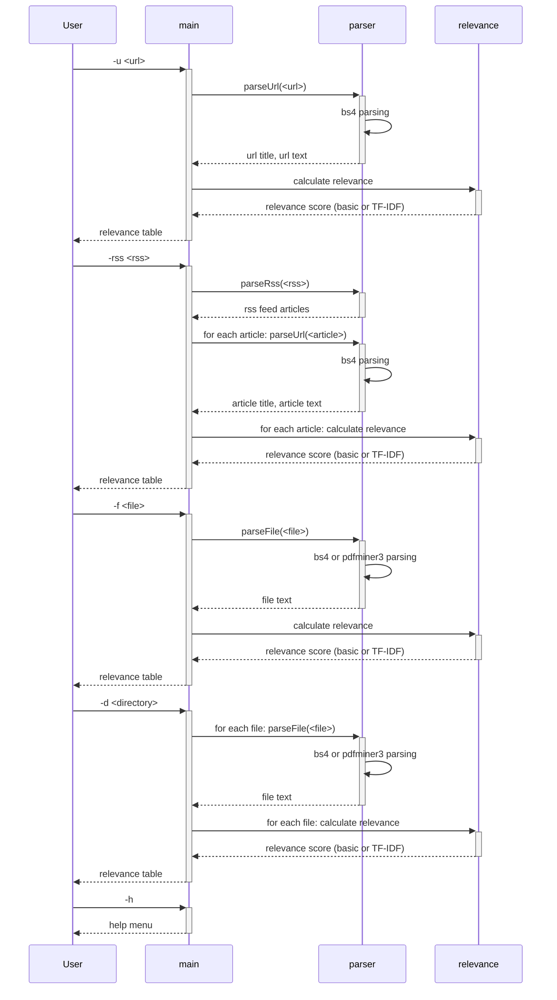

# Cyber Threat Intelligence Reporting Tool System Diagram

```mermaid
sequenceDiagram
   participant User
   participant main
   participant parser
   participant relevance

   # URL parsing
   User->>+main: -u <url>
   main->>+parser: parseUrl(<url>)
   parser->>parser: bs4 parsing
   parser-->>-main: url title, url text
   main->>+relevance: calculate relevance
   relevance-->>-main: relevance score (basic or TF-IDF)
   main-->>-User: relevance table

   # RSS Parsing
   User->>+main: -rss <rss>
   main->>+parser: parseRss(<rss>)
   parser-->>-main: rss feed articles
   main->>+parser: for each article: parseUrl(<article>)
   parser->>parser: bs4 parsing
   parser-->>-main: article title, article text
   main->>+relevance: for each article: calculate relevance
   relevance-->>-main: relevance score (basic or TF-IDF)
   main-->>-User: relevance table
   
   # File Parsing
   User->>+main: -f <file>
   main->>+parser: parseFile(<file>)
   parser->>parser: bs4 or pdfminer3 parsing
   parser-->>-main: file text
   main->>+relevance: calculate relevance
   relevance-->>-main: relevance score (basic or TF-IDF)
   main-->>-User: relevance table
   
   # Directory Parsing
   User->>+main: -d <directory>
   main->>+parser: for each file: parseFile(<file>)
   parser->>parser: bs4 or pdfminer3 parsing
   parser-->>-main: file text
   main->>+relevance: for each file: calculate relevance
   relevance-->>-main: relevance score (basic or TF-IDF)
   main-->>-User: relevance table

   # Help Menu
   User->>+main: -h
   main-->>-User: help menu
```
